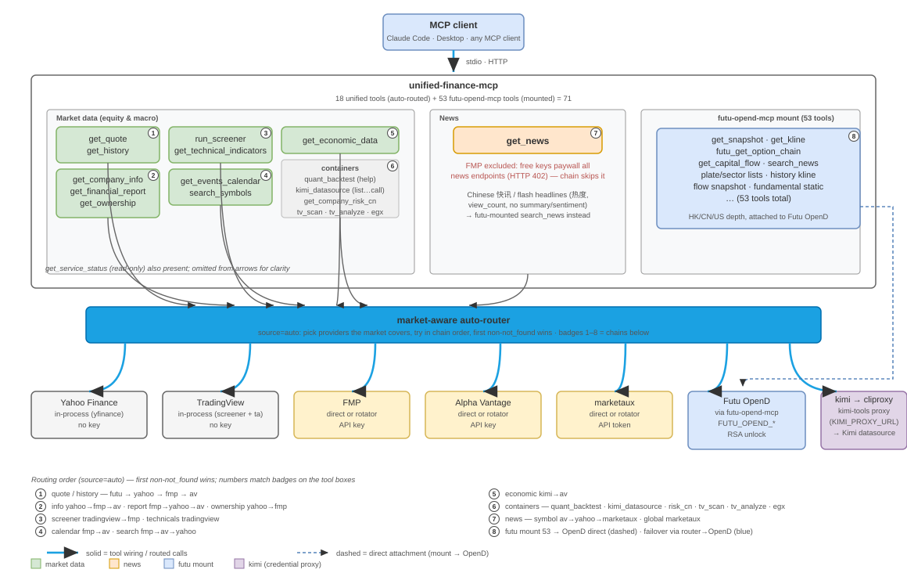

# unified-finance-mcp

[](https://github.com/xyonium/finance-mcp/actions/workflows/ci.yml)
[](https://pypi.org/project/unified-finance-mcp/)
[](https://pypi.org/project/unified-finance-mcp/)
[](https://github.com/xyonium/finance-mcp/blob/main/LICENSE)

One MCP server for finance data: Yahoo Finance, TradingView, FMP, Alpha Vantage,
marketaux, Futu OpenD and the Kimi Datasource meta-source behind a single tool
surface, with market-aware auto-routing across sources. **`auto` means the
model stops choosing providers**: ask for a quote, a financial statement or
an option chain and the server picks the sources that cover that market,
tries them in chain order, and returns the first non-empty answer — the
model calls one tool, not four.

## Features

| Surface | Tools | Notes |
|---|---|---|
| Unified tools | 19 | Domain-organized, cross-source tools with a `source` parameter — `auto` routes by market coverage, or pin one source explicitly. Per-symbol indicator queries (options / short / analyst / dividends / earnings) share one container: `get_symbol_intel(kind=…)` |
| **TradingView containers** | 3 | `tv_scan`, `tv_analyze`, `egx_market` — scanner/analysis containers selected by `action` (unknown actions return the available list) |
| **CEX container** | 1 | `cex_market` — crypto-exchange USDT-settled perpetuals on Bitget/Gate/MEXC/OKX/Binance: `quote`/`kline`/`summary`/`funding`/`open_interest`/`exchanges`/`symbols` by `action`. TradingView (screener=`crypto`) for quote/summary, exchange REST for kline/funding/OI |
| **Futu OpenD mount** | 53 | All `futu-opend-mcp` tools mounted alongside the unified ones when OpenD is configured. `FINANCE_MCP_FUTU_MOUNT_LAYOUT=grouped` folds them into 6 market-analysis containers + 1 on-demand reference container (`action=list/describe/call`), shrinking the surface from 76 to 28 tools |
| **L2 self-describing containers** | 2 | `quant_backtest` and `kimi_datasource` keep secondary functionality out of the primary tool list; call with `action='help'` / `action='list'` to discover them |
| **Diagnostics** | 1 | `get_service_status` reports provider availability, coverage and mounted tool counts (read-only, no network I/O) |

**Data sources:** Yahoo Finance · TradingView · FMP · Alpha Vantage · marketaux ·
Futu OpenD · Kimi Datasource (tianyancha CN company data, World Bank / IMF macro
series, SEC EDGAR, S&P Capital IQ, gildata screener data, and more).

The unified tools accept futu (`HK.00700`), Yahoo (`0700.HK`, `COMI.CA`) and
TradingView (`EGX:COMI`) symbol forms; bare tickers default to US.

## Architecture



One server, two faces: the 19 unified tools route through a market-aware
auto-router to the external providers (solid lines), while the 53 mounted
`futu-opend-mcp` tools attach directly to a running Futu OpenD gateway
(dashed; shown in the default `flat` layout — `grouped` folds them into 6
market-analysis containers + 1 on-demand reference container, 28 tools
total). Badges 1–8 on the tool boxes map to the routing chains in the
legend. Editable source: [docs/architecture.drawio](docs/architecture.drawio).

## Install

Requires Python ≥ 3.10.

```bash
uvx unified-finance-mcp          # ephemeral run (uv)
pipx install unified-finance-mcp # persistent install
pip install unified-finance-mcp  # classic install
```

The console entry point is `unified-finance-mcp`. By default it serves stdio
(MCP client spawns it directly); `--transport http` serves streamable HTTP
with a `/health` endpoint.

## Configuration

All configuration is via environment variables. The server's own knobs use the
`FINANCE_MCP_*` prefix; third-party credentials keep their vendor names.
Every key is optional — each provider activates only when its credential is
present, and auto-routing skips unavailable sources.

### Core (all providers)

| Variable | Purpose | Default |
|---|---|---|
| `FINANCE_MCP_TRANSPORT` | `stdio` or `http` (or CLI `--transport`) | `stdio` |
| `FINANCE_MCP_HOST` | HTTP listen host (or CLI `--host`) | `127.0.0.1` |
| `FINANCE_MCP_PORT` | HTTP listen port (or CLI `--port`) | `8000` |
| `FINANCE_MCP_REQUEST_TIMEOUT` | Per-source request timeout (seconds) | `20` |
| `FINANCE_MCP_MAX_RETRIES` | HTTP retry count | `3` |
| `FINANCE_MCP_MIN_HOST_DELAY` | Minimum delay between requests to one host (seconds) | `0.5` |
| `FINANCE_MCP_FUTU` | `0` disables the Futu OpenD mount entirely | `true` |
| `FINANCE_MCP_FUTU_MOUNT_LAYOUT` | `flat` mounts all 53 futu-opend-mcp tools side-by-side; `grouped` folds them into 6 market-analysis `futu_*` containers + 1 on-demand `futu_reference` container (`action=list/describe/call`), 76 → 28 tools | `flat` |
| `FINANCE_MCP_CEX` | `0` disables the `cex_market` container | `true` |
| `FINANCE_MCP_CEX_EXCHANGES` | Comma-separated whitelist for `cex_market` (failover order) | `bitget,gate,mexc` |
| `FINANCE_MCP_CEX_PRODUCT` | Bitget product type for candle requests | `USDT-FUTURES` |
| `FINANCE_MCP_CEX_TV_SCREENER` | TradingView screener slug for the CEX quote/summary path | `crypto` |

### FMP

Free API key: <https://site.financialmodelingprep.com/register>

| Variable | Purpose | Default |
|---|---|---|
| `FMP_API_KEY` | FMP API key | — |
| `FMP_BASE_URL` | FMP endpoint override; point it at your multi-key rotator, e.g. `http://api-key-rotator:8788/fmp` | `https://financialmodelingprep.com` |

### Alpha Vantage

Free API key: <https://www.alphavantage.co/support/#api-key>

| Variable | Purpose | Default |
|---|---|---|
| `ALPHAVANTAGE_API_KEY` | Alpha Vantage API key | — |
| `ALPHAVANTAGE_BASE_URL` | Endpoint override (rotator-friendly), e.g. `http://api-key-rotator:8788/alphavantage` | `https://www.alphavantage.co` |

### marketaux

Free API token: <https://www.marketaux.com/register>

| Variable | Purpose | Default |
|---|---|---|
| `MARKETAUX_API_TOKEN` | marketaux news API token | — |
| `MARKETAUX_BASE_URL` | Endpoint override (rotator-friendly), e.g. `http://api-key-rotator:8788/marketaux` | `https://api.marketaux.com` |

### Kimi Datasource

Auth resolution order: `KIMI_PROXY_URL` → `KIMI_ACCESS_TOKEN` → `KIMI_AUTH_FILE`.
Exactly one way needs to be configured for the kimi tools to activate.

| Variable | Purpose | Default |
|---|---|---|
| `KIMI_PROXY_URL` | **Primary.** URL of a proxy that injects credentials for you — e.g. the CLIProxyAPI [`cliproxy-kimi-tools`](https://github.com/xyonium/cliproxy-kimi-tools) plugin at `http://cli-proxy-api:8317/v0/management/kimi/tools`, or a standalone `kimi-datasource-proxy` container. When `KIMI_ACCESS_TOKEN` is also set, it is sent as `Authorization: Bearer …` (the CLIProxyAPI management key) and the proxy strips it before talking to Kimi. | — |
| `KIMI_AUTH_FILE` | **Fallback.** Path (or glob) to a cliproxy kimi credential JSON, e.g. `/mnt/docker/cliproxy/auths/kimi-*.json` — the first file with `disabled != true` is used; the client self-refreshes the token when it expires | — |
| `KIMI_ACCESS_TOKEN` | **Fallback (direct).** A Kimi Code token used directly against `KIMI_BASE_URL`, with no refresh logic. *With `KIMI_PROXY_URL` set:* doubles as the proxy's management key (see above). | — |
| `KIMI_BASE_URL` | Upstream endpoint used with the two fallback paths | `https://api.kimi.com/coding/v1/tools` |
| `KIMI_FILES_DIR` | Where datasource result files are written | `/tmp/unified_finance_mcp` |

### Futu OpenD (inherited from futu-opend-mcp)

| Variable | Purpose | Default |
|---|---|---|
| `FUTU_OPEND_HOST` | OpenD gateway host | `127.0.0.1` |
| `FUTU_OPEND_PORT` | OpenD gateway port | `11111` |
| `FUTU_OPEND_ENCRYPT` | Use encrypted protocol | `true` |
| `FUTU_OPEND_RSA_KEY` / `FUTU_OPEND_RSA_KEY_FILE` | RSA private key (inline or file) for encrypted OpenD | — |

## Client configuration

### Claude Code

```bash
# stdio (default transport)
claude mcp add finance -- uvx unified-finance-mcp

# with environment, e.g. your API keys + rotator endpoints
claude mcp add finance \
  --env FMP_API_KEY=<your-fmp-key> \
  --env FMP_BASE_URL=http://api-key-rotator:8788/fmp \
  --env KIMI_PROXY_URL=http://kimi-datasource-proxy:8788/coding/v1/tools \
  --env FUTU_OPEND_HOST=192.168.1.10 \
  -- uvx unified-finance-mcp

# streamable HTTP mode (server started with --transport http)
claude mcp add --transport http finance http://127.0.0.1:8000/mcp
```

### claude_desktop_config.json

```json
{
  "mcpServers": {
    "finance": {
      "command": "uvx",
      "args": ["unified-finance-mcp"],
      "env": {
        "FMP_API_KEY": "<your-fmp-key>",
        "FMP_BASE_URL": "http://api-key-rotator:8788/fmp",
        "ALPHAVANTAGE_API_KEY": "<your-av-key>",
        "KIMI_PROXY_URL": "http://kimi-datasource-proxy:8788/coding/v1/tools",
        "FUTU_OPEND_HOST": "127.0.0.1"
      }
    }
  }
}
```

### Streamable HTTP (any MCP client)

Start the server:

```bash
FINANCE_MCP_TRANSPORT=http unified-finance-mcp --port 8000
# or: unified-finance-mcp --transport http --port 8000
```

then connect to `http://127.0.0.1:8000/mcp` (health probe at
`http://127.0.0.1:8000/health`).

## Migrating from mcpo (5 servers → 1)

Replace the mcpo-aggregated stack — futu-opend, yfinance, tradingview (wrapped
through mcpo) plus FMP and Alpha Vantage over streamable HTTP — with a single
unified-finance-mcp entry.

Before (mcpo config, five servers):

```json
{
  "mcpServers": {
    "futu":        { "command": "uvx", "args": ["futu-opend-mcp"] },
    "yfinance":    { "command": "mcpo", "args": ["--config", "/path/to/yfinance-mcp.json"] },
    "tradingview": { "command": "mcpo", "args": ["--config", "/path/to/tradingview-mcp.json"] },
    "fmp":         { "type": "sse", "url": "http://localhost:8788/fmp" },
    "alphavantage":{ "type": "sse", "url": "http://localhost:8788/alphavantage" }
  }
}
```

After:

```json
{
  "mcpServers": {
    "finance": {
      "command": "uvx",
      "args": ["unified-finance-mcp"],
      "env": {
        "FMP_API_KEY": "<your-fmp-key>",
        "FMP_BASE_URL": "http://api-key-rotator:8788/fmp",
        "ALPHAVANTAGE_API_KEY": "<your-av-key>",
        "MARKETAUX_API_TOKEN": "<your-marketaux-token>",
        "KIMI_PROXY_URL": "http://kimi-datasource-proxy:8788/coding/v1/tools",
        "FUTU_OPEND_HOST": "127.0.0.1"
      }
    }
  }
}
```

The same credentials carry over; yfinance and tradingview need no key (they are
backed by `yfinance` and `tradingview-ta`/`tradingview-screener` in-process, which
also removes the Python ≥3.14 wrapper constraint mcpo hit).

## Tool quick reference

| Tool | What it does |
|---|---|
| `get_quote` | Latest snapshot for one or more symbols (futu/yahoo/TV symbol forms) |
| `get_history` | OHLCV history; `interval` 1m–1mo, `start`/`end` dates |
| `get_company_info` | Company profile: name, sector, market cap, description |
| `get_financial_report` | Income / balance / cashflow statements, annual or quarterly |
| `get_news` | Symbol news, or global headlines with `symbol=None` |
| `get_technical_indicators` | Ratings summary + indicator values (`summary` or named indicators) |
| `run_screener` | Screen stocks by market and numeric filters, sorted and limited |
| `get_ownership` | Major / institutional / mutual-fund holders, insider transactions & summary |
| `get_events_calendar` | Earnings, dividends, IPO calendar (date range optional) |
| `get_economic_data` | Macro series: GDP, CPI, unemployment, rates, treasury yields, … |
| `search_symbols` | Search symbols by company name or ticker |
| `get_symbol_intel` | Per-symbol indicator queries by `kind`: `options` (chain at one `expiration`, calls/puts IV/OI) · `short` (shares short, days-to-cover, % of float) · `analyst` (estimates, price targets, recommendations) · `dividends` (history + next dates) · `earnings` (EPS est. vs reported + surprise %, `limit` rows) |
| `get_company_risk_cn` | CN company risk profile from tianyancha (via kimi) |
| `quant_backtest` | Strategy backtest container: `run` / `compare` / `walk_forward`; `action='help'` for the full parameter guide |
| `kimi_datasource` | Self-describing datasource access: `action='list'` / `'describe'` / `'call'` |
| `tv_scan` | TradingView exchange-wide scans (top gainers/losers, volume breakout, …) by `action` |
| `tv_analyze` | TradingView symbol analysis (summary, candle patterns, multi-timeframe, …) by `action` |
| `egx_market` | Egyptian Exchange tools (overview, sector scan, index, screener, trade plan, fibonacci) by `action` |
| `cex_market` | Crypto-exchange USDT-settled perpetuals by `action` (`quote`/`kline`/`summary`/`funding`/`open_interest`/`exchanges`/`symbols`). Default whitelist `bitget,gate,mexc`; `okx`/`binance` are TradingView-only (quote/summary) and opted in via `FINANCE_MCP_CEX_EXCHANGES`. CL here is a USDT PERPETUAL (funding rate, 24/7), NOT CL=F / NYMEX:CL1! |
| `get_service_status` | Provider availability/coverage and mounted tool counts (read-only) |

Plus the 53 mounted `futu-opend-mcp` tools (`get_snapshot`, `get_kline`,
`futu_get_option_chain`, `get_capital_flow`, …) for HK/CN/US depth from OpenD —
or, with `FINANCE_MCP_FUTU_MOUNT_LAYOUT=grouped`, seven `futu_*` containers
selected by `action=list | describe | call`: six market-analysis domains
(`futu_market`, `futu_fundamentals`, `futu_corporate`, `futu_capital`,
`futu_options`, `futu_macro`) plus `futu_reference`, which folds everything
not market-analysis related (company profile/executives, sector & industry
chains, the institution directory and its reverse holdings lookups) out of
the primary list and behind one on-demand container.

## Development

```bash
pip install -e ".[dev]"
ruff check .                        # lint
pytest -q -m "not integration"      # unit suite (integration marker needs live APIs/OpenD)
```

Layout: `src/unified_finance_mcp/` — `providers/` (Yahoo, TradingView, FMP,
Alpha Vantage, marketaux, Futu bridge, Kimi), `tools/` (the 16 tool modules
registered from `ALL_MODULES`, including `intel.py` = `get_symbol_intel`
and `futu_containers.py` = the grouped futu domain containers), `config.py`
(env `Settings`), `http.py` (polite per-host rate-limited client).

## Release process

1. Push your changes to `main` and confirm CI is green (ruff + pytest).
2. On [PyPI](https://pypi.org/manage/project/unified-finance-mcp/publishing/),
   add this repository as a **pending trusted publisher** (one-time setup).
3. Tag and push:

```bash
git tag v0.1.0 && git push origin v0.1.0
```

`publish.yml` builds the wheel/sdist and publishes to PyPI via OIDC trusted
publishing (no tokens stored in the repo).

## License

MIT
